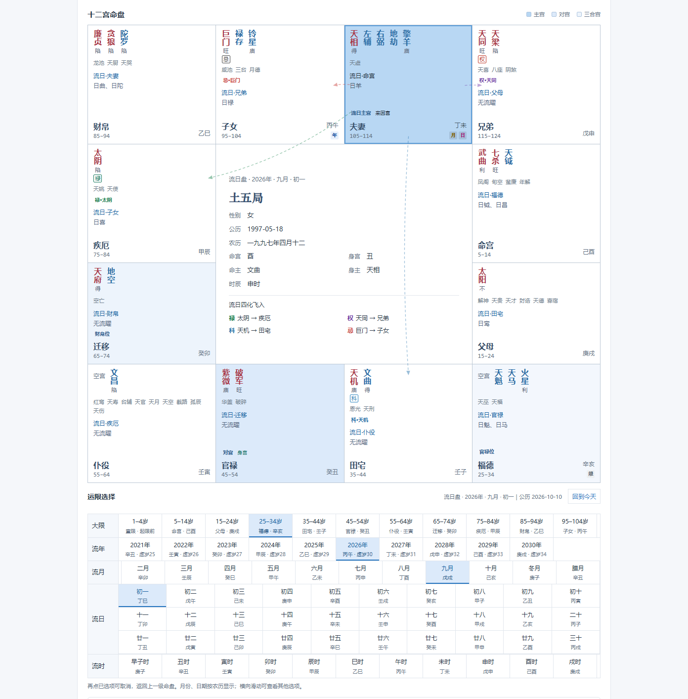
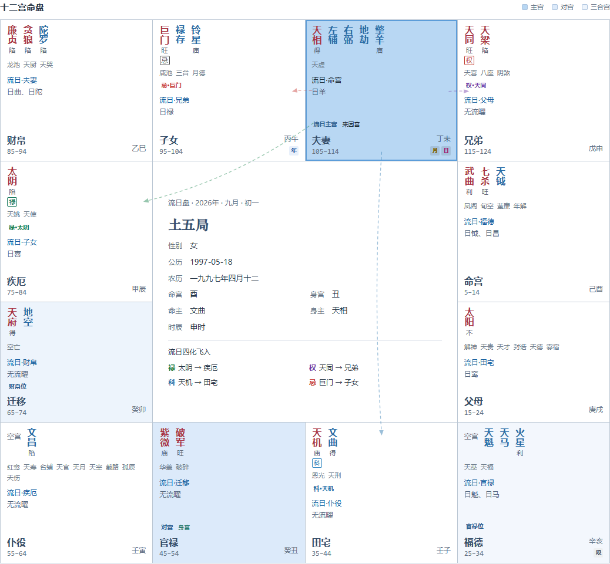
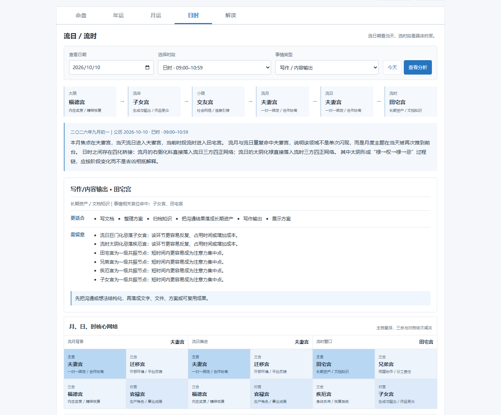
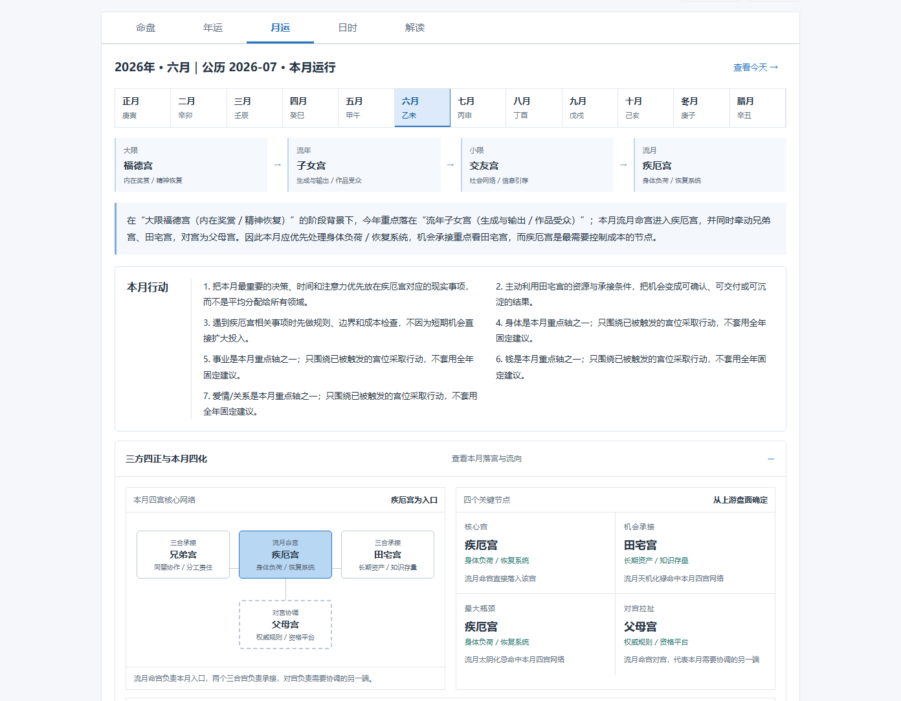
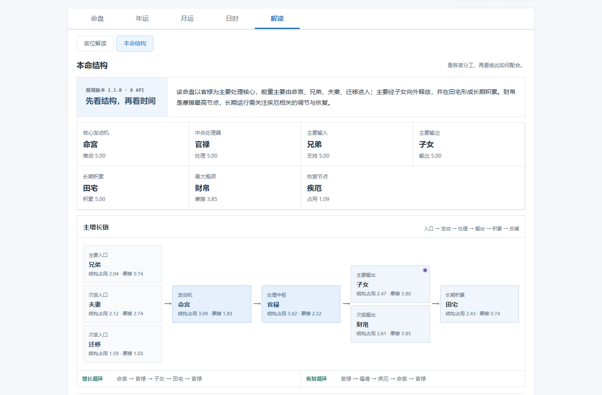
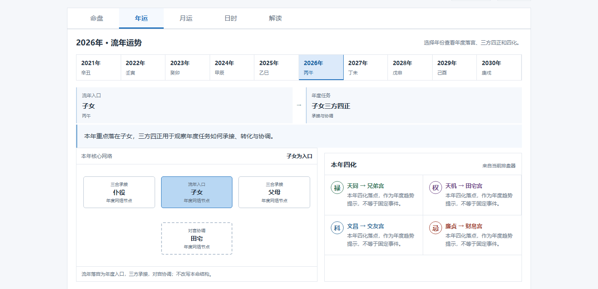
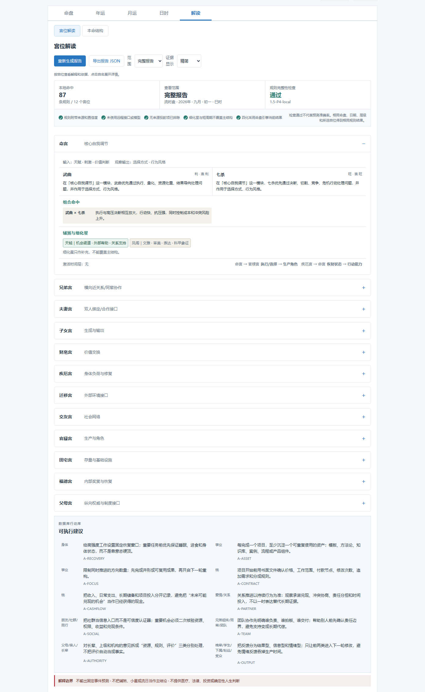
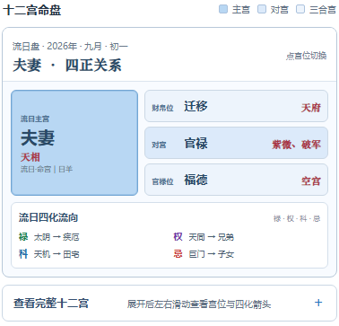

# 紫微时域

**十二宫可视化 × 五级运限查询 × 每日流日／流时分析**

> 不只是把命盘排出来，而是把不同年份、农历月份、日期和时辰如何改变盘面，做成一套能看见、能切换、能追踪的可视化系统。

## 30 秒看懂它能做什么

| 核心能力 | 用户实际看到的结果 |
| --- | --- |
| 十二宫联动 | 当前主宫最深，对宫与两个三合宫分层着色，关系不再藏在文字里 |
| 五级运限 | 在同一张盘中切换大限、流年、农历流月、流日、流时 |
| 每日查询 | 只选日期就看到流日；再选具体时段，才继续叠加流时 |
| 农历流月 | 正月至腊月逐月切换，可直接查看农历六月等月份的重点变化 |
| 四化箭头 | 禄、权、科、忌四条流向常显，用不同颜色连接起点与落宫，并追踪月→日→时的跨层过程链 |
| 本地计算 | 排盘、规则和数据库全部随网页打包，不调用 LLM 或 AI API |



上图就是核心工作区：上方是十二宫与四化方向，下方是“大限 → 流年 → 流月 → 流日 → 流时”选择器。切换任一级，主宫、三方四正和四化落点都会同步变化。

## 四个核心创新

### 1. 宫位不是十二个孤立盒子，而是一张带四化流向的关系网络

点击任意宫位或选择任一运限层，盘面会同时更新两套关系：

- **宫位关系**：最深色标出当前主宫，再用三档浅色区分对宫与两个三合宫。
- **四化流向**：禄、权、科、忌四条箭头直接连接飞出起点与落宫，并按四化分色常显。
- **动态联动**：切换流年、流月、流日、流时或手动点击宫位后，箭头起点、落点和宫位颜色同步重算。
- **语义区分**：同宫回环与真正的自化分别标记，不把所有飞回本宫都解释成自化。



这张近景图专门展示关系网络：先通过深浅颜色判断主宫与三方四正，再沿绿色、紫色、蓝色和红色箭头查看禄、权、科、忌分别飞向哪里。

### 2. 流日与流时严格分层，不把短时信号夸大

只选择日期时，分析停在流日；只有选择具体时段后才叠加流时。月、日、时分别计算三方四正，流日不能推翻流月，流时也不能推翻流日。



页面会同时说明当前作用链、最终焦点宫、更适合做什么、需要留意什么，以及月→日、日→时的四化桥接和同星转换过程。行动建议来自盘面与用户选择的现实场景，不套固定吉时模板。

### 3. 流月不是一句“好或不好”，而是可以逐月核对的变化

农历正月至腊月均可直接切换，包括农历六月。每个月都会重新展示作用链、核心宫、三方四正、四化、共振节点和现实领域。



当前版本提供逐月切换与对照，不把离散规则结果包装成一条看似精确、实际无法核对的连续运势曲线。

### 4. 从“看一个宫”继续走到“看整套系统如何运转”

本命结构页把十二宫映射为核心发动机、处理中枢、主要输入、主要输出、长期积累、最大瓶颈和恢复节点，让用户看到各宫如何分工、连接和反馈。



## 其他核心页面

### 年运：查看年度入口与年度任务

指定年份后，页面展示流年落宫、年度三方四正网络和四化落点。流年负责说明年度任务，但不改写本命结构。



### 宫位解读：先给结论，再展开依据

宫位解读按十二宫分段，呈现主星×宫位、同宫组合、辅煞细化、四化、时间层和功能链。精简模式适合快速阅读，完整模式保留规则来源与推断边界。



### 手机端：保留完整盘面，不牺牲核心信息

手机端沿用同一套命盘和时间层级。运限横向滑动，星曜、宫名、四化和颜色关系不因小屏幕被隐藏。



## 使用逻辑

1. 输入出生日期、时辰和性别，生成本命盘。
2. 在命盘下方依次选择大限、流年、农历流月、流日和流时。
3. 再次点击已选项，即可取消当前层并回到上一级。
4. 需要当天判断时进入“日时”，只选日期看流日，选择时段后再看流时。
5. 需要文字依据时进入“解读”，查看宫位报告或本命系统结构。

## 当前功能

- 公历／农历排盘、闰月与晚子时口径
- 完整十二宫、主辅杂曜、庙旺和生年四化
- 大限、小限、流年、流月、流日、流时
- 主宫、对宫、两个三合宫分层着色
- 禄、权、科、忌飞入方向与自化区分
- 多层共振、跨层桥接和同星四化过程链
- 年运、月运、日时、宫位解读和本命结构
- 本地命例保存、JSON 备份与导入
- 命盘 PNG、当前页面打印／PDF
- 微信、邮箱人工咨询与自愿支持入口

## 直接使用

下载仓库后双击根目录的 `index.html`，即可离线打开完整版。

也可以启动任意静态文件服务器：

```powershell
node tools/dev-server.cjs 8000
```

然后访问 `http://127.0.0.1:8000/`。

## 计算边界

- 运限落宫和四化来自网页内置排盘器；缺少上游数据时明确报错，不猜测补全。
- 本命定结构，大限定阶段，流年定年度任务，流月定月度焦点，流日推进当天步骤，流时只细化短时窗口。
- 下层信号不能推翻上层；短周期缺少上层支持时，会明确降低信号强度。
- “规则完整性检查”不等于预测准确率，也不代表已经与所有流派、所有商业排盘软件逐盘一致。
- 本项目是传统文化信息整理与排盘数据查看工具，不提供医疗、法律、投资或确定性人生判断。

详细数据来源、版本冲突和待核事项见 [`knowledge-base/ORIGIN.md`](knowledge-base/ORIGIN.md)。

## 项目结构

```text
index.html                  页面入口
app.js                     命盘与五级运限交互
monthly-runtime.js         流月运行
daily-hourly-runtime.js    流日／流时运行
system-engine.js           本命系统结构
knowledge-data.js          浏览器可直接读取的本地规则包
knowledge-base/            P0–P6 原始规则、配置与回归样例
vendor/                    内置排盘组件与第三方许可证
tests/                     浏览器与规则回归测试
docs/screenshots/          README 页面截图
```

主要回归测试：

```powershell
node tests/smoke.cjs
node tests/p6-regression.cjs
node tests/transit-toggle.cjs
node tests/accuracy-workspace.cjs
node tests/default-birth-date.cjs
```

## 人工核对

- 微信：`Thanks1900ss`
- 邮箱：`bobominitt@gmail.com`

## 第三方许可证

本仓库随 `vendor/` 保留所用开源排盘组件的原始 MIT 许可证，见[第三方许可证文件](vendor/third-party-MIT-LICENSE.txt)。
