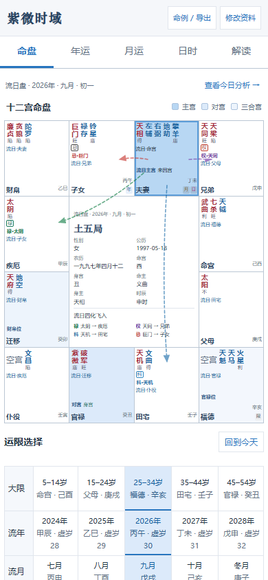

# 紫微时域

> 我给自己做的一张长期使用的紫微命盘：完整十二宫一直在，流年、农历流月、流日和流时可以直接切换，宫位关系与四化方向会跟着时间一起变化。

它不是把十二宫排成十二个互不相干的格子，也不是生成一段听起来都对、却不知道依据在哪里的运势文字。我真正想保留的是看盘时的思路：当前重点落在哪一宫，三方四正怎样承接，禄、权、科、忌飞到哪里，换一个月份或日期以后又发生了什么变化。

如果只想快速知道它和普通排盘页有什么区别，主要就是这四件事：

- **完整命盘始终是入口**：点任意宫位，主宫、两个三合宫、对宫和四化箭头一起更新。
- **流月和流日真的可以反复查**：月份按农历切换；只选日期分析到流日，选具体时段才继续分析流时。
- **每一层各做各的事**：本命、大限、流年、流月、流日、流时逐层细化，下层信号不会把上层结构推翻。
- **排盘和规则留在本地**：不依赖 LLM 或 AI API，下载后双击网页也能使用。

我做这个网页的原因其实也很简单：平时真正会反复打开的功能没有那么多。我自己最常看的是流月和流日；帮别人看盘时，最需要的也不是再看一遍星曜列表，而是快速弄清楚几个宫之间怎么牵动，再把这些关系讲明白。

原来常用的排盘工具最近不太稳定，不少软件又把流月、流日放在付费区，有时只是想看一个落宫也要先开会员。可大家点开流月、流日，通常就是手上有一件具体的事，想知道这段时间适不适合推进、问题可能卡在哪里。既然这些也是我自己长期要用的，我干脆按照自己的使用顺序重新做了一套。

这不是一个追求功能越多越好的平台。它首先是我自己会长期打开的工具，也是一份可以离线保存、不会因为某个外部服务变化就突然不能用的版本。

> ⭐ 如果这个项目也刚好帮你省下了反复查盘的时间，欢迎[点一个 Star](https://github.com/Boboloveseggs/ziwei-shiyu-core-chart)。网页免费使用，愿意支持后续维护的话，文末也放了自愿支持入口。


## 我为什么把它做成这样

### 看盘时，十二宫不应该是十二个孤立盒子

我需要的是一眼看到关系：当前重点宫在哪里，两个三合宫怎么承接，对宫又在牵制什么。所以盘面用最深色标主宫，再用浅色分出三方四正。

四化箭头也不是装饰。禄、权、科、忌会一直显示在盘上，直接连接飞出位置和落宫。切换流年、流月、流日、流时，或者手动点另一个宫，颜色和箭头都会一起重算。同宫回环和真正的自化也会分开标，不混在一起解释。


### 我用得最多的，其实是流月和流日

年运适合看一整年的背景，但真正在生活里反复查询的，往往是“这个月重点在哪”和“今天这件事适不适合做”。

月运按农历月份切换。正月到腊月都可以直接点，包括农历六月。每换一个月，核心宫、三方四正、四化和共振位置都会重新显示，不只给一句笼统的“好”或“不好”。


日时页面则故意分成两步：只选日期，就只看到流日；真的需要看具体时段，再选择流时。因为流时只是当天更细的一层，不能反过来推翻流日，流日也不能推翻流月。


### 帮别人看盘时，需要快速把关系讲明白

有时候知道星曜落在哪里还不够，真正难的是把它们之间的关系说清楚。所以我又加了宫位解读和本命结构：前者适合按宫位往下讲，后者把十二宫整理成发动、处理、输入、输出、积累、瓶颈和恢复，让整张盘更像一套会互相影响的能量系统。

年运也单独保留，用来先确定这一年的任务背景；本命、年、月、日、时各做各的事，不让短周期把长期结构盖掉。

<details>
<summary><strong>展开看看年运、宫位解读和本命结构</strong></summary>


</details>

## 每个页面为什么会存在

- **命盘**：先把主宫、三方四正和四化飞向看清楚，避免只盯着单个星曜。
- **年运**：确定这一年的大背景和年度任务，不负责替代本命。
- **月运**：这是我使用频率最高的入口，用来看农历月份的重点变化。
- **日时**：有具体事情时再查，日期和时段分开，不把很短的信号无限放大。
- **宫位解读**：帮别人看盘时，能更快把每个宫的作用和依据说清楚。
- **本命结构**：把十二宫从“星曜列表”重新组织成一套有输入、处理、输出和反馈的关系系统。
- **命例与导出**：方便长期保存自己的盘，也方便把当天看到的内容留档。

## 为什么没有接 AI API

这个方向我其实试过。

最开始我也把命盘导出来交给 AI，希望它能直接讲出我真正关心的关系。但实际使用下来，经常遇到几个问题：同一张盘换一次对话，重点就会变；时间层一多，前面的信息容易丢；等它重新生成一次也需要时间。最后得到的内容往往还是“注意沟通”“稳中求进”这一类比较浅的总结。

可我真正想看的不是一段听起来顺畅的话，而是：哪一层把哪个宫推到了前台，三方四正怎样承接，哪颗星的四化从月走到日、再走到时，最后为什么把重点落在这个宫。

后来翻了不少古籍和排盘资料，我越来越确定，紫微命盘里有相当一部分内容本来就有明确规则。落宫、三方四正、四化和时间层级这些能按规则算清楚的东西，没有必要每点一次都让 AI 重新猜一遍。那样不仅慢，还可能在重述时漏掉已经确定的信息。

所以这个网页先把能确定的部分写成代码，在本地直接计算。它不是反对 AI，而是不让 AI 代替本来可以稳定复现的基础逻辑。如果真的想继续让 AI 分析，可以导出命盘或报告，再交给自己习惯的工具；只是以我目前的试用结果来看，AI 的泛化解读还没有细到我最想听的那一层。

## 关于公开范围

我愿意公开的是可以直接运行的页面、基础排盘流程和目前稳定的交互，方便自己备份，也方便有相同需求的人参考。

但这不是一份准备把所有研究过程都摊开的完整规则书。长期整理的个人解释口径、案例库、仍在核验的判断阈值，以及后面继续补充的部分规则会保留。这样既能保护长期投入，也能避免还没有验证完的内容被当成定论传播。

简单说：网页可以正常使用，核心思路也会说明，但不会把每一条内部判断和全部研究笔记都写进介绍里。

## 手机端

手机端打开后直接显示完整十二宫，不把核心命盘藏进二级入口。盘面会按手机宽度压缩非核心文字，保留宫名、主星、当前运限、主宫与三方四正颜色，以及四化箭头；数据与桌面端仍然是同一套。

<p align="center">
  
</p>

## 怎么使用

下载仓库后，直接双击根目录的 `index.html` 就能离线打开。出生资料只在当前浏览器里参与计算，不需要账号，也不会因为没有远程接口而停止工作。

需要本地预览服务器时可以运行：

```powershell
node tools/dev-server.cjs 8000
```

然后打开 `http://127.0.0.1:8000/`。

## 先把边界说清楚

- 缺少排盘数据时会直接提示，不会为了凑出答案而猜。
- 本命定结构，大限定阶段，流年定年度任务，流月、流日和流时逐层细化，下面的层级不能推翻上面的层级。
- 页面是传统文化信息整理与排盘数据查看工具，不提供医疗、法律、投资或确定性人生判断。
- 不同流派和排盘口径可能存在差异，使用前请先确认自己采用的口径。

## 如果它帮到了你

点一个 Star 就已经是很直接的支持，也能让我知道这套整理方式确实有人用得上：

👉 [给紫微时域点一个 Star](https://github.com/Boboloveseggs/ziwei-shiyu-core-chart)

如果它帮你省下了时间，也欢迎自愿支持后续维护。金额随意，不影响任何功能。

<table>
  <tr>
    <td align="center"><br />微信支付</td>
    <td align="center"><br />支付宝</td>
  </tr>
</table>

人工核对：微信 `Thanks1900ss`　邮箱 `bobominitt@gmail.com`

## 第三方许可证

仓库随 `vendor/` 保留所用开源排盘组件的原始 MIT 许可证，见[第三方许可证文件](vendor/third-party-MIT-LICENSE.txt)。
